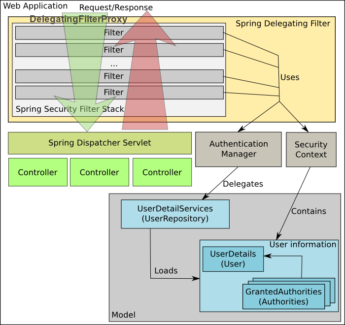

### Spring Security ###
1. It secure both java SE/EE app. it provides both authentication and authorization
    1. authentication : check who want to enter into system. it checks username/password valid
    2. authorization : which part of app he access it controls that
2. Provides powerful and elegant security mechanism
3. Provides Declarative Security Programming(No need own logic code)
4. Easy of Extendability

### Architecture ###


Spring security combinations of pre and post servlet filter called `filterchain`. DelegatingFilterProxy just delegates request to `filterchain`. filterchain use two thing to process filter
1. Authenticate Manager : it delegates request to `UserDetailsService` thats loads `UserDetails`
2. Security Context : it contains `UserDetails` after authentication
 Note : spring implemented class (`User`) .it use `GrandtedAuthorities` . 
 spring implemented class (`Authorities`) object
### Spring Security on Spring Boot App ###

Create App Boot App using spring boot cli

`spring init -n=SpringSecurity -g=com.javaaround --package-name=com.javaaround.security -d=Web,Security,JPA,Thymeleaf,MySql,DevTools --build=maven SpringSecurity`

Create Home Controller.java

```java
package com.javaaround.security.controller;

import org.springframework.stereotype.Controller;
import org.springframework.ui.Model;
import org.springframework.web.bind.annotation.GetMapping;
import org.springframework.web.bind.annotation.RequestParam;

@Controller
public class HomeController {
	
	@GetMapping("/")
	String index(@RequestParam(value="name", required=false, defaultValue="shamim") 
	String name, Model model) {
        model.addAttribute("name", name);
		return "index";
	}
}

```

Add @EnableWebSecurity annotation at SpringSecurityApplication.java

```java
package com.javaaround.security;

import org.springframework.boot.SpringApplication;
import org.springframework.boot.autoconfigure.SpringBootApplication;
import org.springframework.security.config.annotation.web.configuration.EnableWebSecurity;

@SpringBootApplication
@EnableWebSecurity
public class SpringSecurityApplication {

	public static void main(String[] args) {
		SpringApplication.run(SpringSecurityApplication.class, args);
	}
}

```
Create index.html

```html
<!DOCTYPE HTML>
<html xmlns:th="http://www.thymeleaf.org">
<head>
    <title>Getting Started: Serving Web Content</title>
    <meta http-equiv="Content-Type" content="text/html; charset=UTF-8" />
</head>
<body>
    <p th:text="'Hello, ' + ${name} + '!'" />
</body>
</html>
```

Thats it . Your application is secure without writing any code

browse your app

`http://localhost:8080/`

it needs username / password to access content

By default spring provide 

`username : user` <br>
`password: show at console`

By above credential you can access your app

https://data-flair.training/blogs/spring-security-tutorial/
https://spring.io/guides/topicals/spring-security-architecture/
https://howtodoinjava.com/spring-security/jdbc-user-service-based-spring-security-example/
https://blog.codecentric.de/en/2017/08/localization-spring-security-error-messages-spring-boot/


